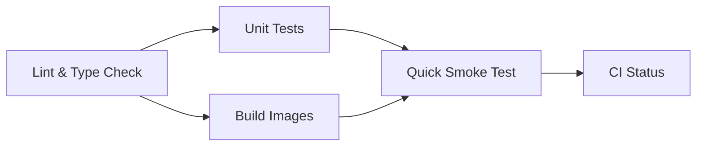
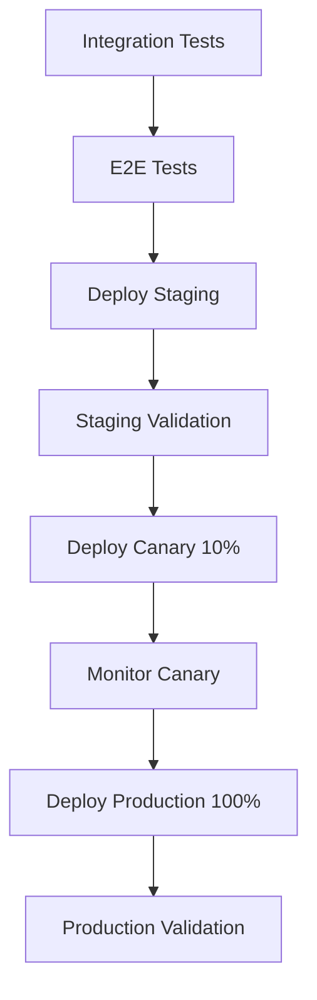

# CI/CD Pipeline Documentation

## 🏗️ Architecture Overview

ObsidianComments uses a **golden path** CI/CD approach with:
- **Fast Lane**: Lint + Unit tests + Build (target <5 minutes)
- **Release Lane**: Integration + E2E + Staging + Canary + Production
- **Blue-Green Deployments** with instant rollback capability
- **Feature Flags** for safe rollouts

## 📋 Workflows

### 01-ci-fast.yml - Fast CI Pipeline
**Triggers:** Every PR and push to main/develop  
**Duration:** <5 minutes  
**Purpose:** Fast feedback loop



**Jobs:**
1. **Lint & Type Check** (3 min) - ESLint, TypeScript, formatting
2. **Unit Tests** (5 min) - Parallel testing of all packages
3. **Build Images** (8 min) - Docker builds with aggressive caching
4. **Quick Smoke Test** (5 min) - Basic health checks
5. **CI Status** - Branch protection gate

### 02-release.yml - Release Pipeline
**Triggers:** Merge to main, tags, manual dispatch  
**Duration:** 15-30 minutes  
**Purpose:** Staging → Production promotion



**Jobs:**
1. **Integration Tests** - Real database + Redis
2. **E2E Tests** - Full stack with Playwright
3. **Deploy Staging** - Blue-green deployment
4. **Deploy Canary** - 10% traffic split
5. **Monitor Canary** - 5-minute validation
6. **Deploy Production** - Full rollout
7. **Validate Deployment** - Health checks + performance

## 🎛️ Feature Flags System

### Configuration
```typescript
// Core stable features
COLLABORATIVE_EDITING: true
DOCUMENT_VERSIONING: true
MARKDOWN_PREVIEW: true

// Experimental features (gradual rollout)
AI_SUGGESTIONS: 10%    // 10% of users
REAL_TIME_CURSORS: 0%  // Disabled until stable
```

### Usage in Code
```typescript
// Backend
const flags = getFeatureFlags();
if (flags.isEnabledForUser('AI_SUGGESTIONS', userId)) {
  // Feature code here
}

// Frontend
const { flags } = await fetch('/api/feature-flags');
if (flags.MODERN_EDITOR) {
  return <ModernEditor />;
}
```

### Emergency Toggle
```bash
# Disable feature instantly across all instances
curl -X POST https://obsidiancomments.serverado.app/api/feature-flags/PROBLEMATIC_FEATURE \
  -H "x-admin-token: $ADMIN_TOKEN" \
  -d '{"enabled": false}'
```

## 🚀 Deployment Strategy

### Blue-Green Deployments
- **Blue**: Current production version
- **Green**: New version being deployed
- **Switch**: Instant traffic cutover via nginx
- **Rollback**: Instant revert to previous version

### Canary Deployments
- Deploy new version to 10% of traffic
- Monitor error rates and performance
- Auto-rollback if error threshold exceeded
- Gradual rollout to 100%

## 🛠️ Local Development

### Quick Start
```bash
# Install dependencies and start services
make setup
make up

# Run tests
make test      # Fast tests only
make test-all  # All tests including E2E

# Development workflow
make dev       # Start development environment
make lint      # Lint all code
make build     # Build production images
```

### Testing Strategy
```bash
# Unit tests (fast, isolated)
make unit

# Integration tests (with real DB/Redis)
make int

# E2E tests (full stack)
make e2e

# Smoke tests (critical path only)
make smoke
```

## 🔧 Commands Reference

### Essential Commands
| Command | Description | Duration |
|---------|-------------|----------|
| `make test` | Lint + unit tests | <2 min |
| `make build` | Build all images | <5 min |
| `make up` | Start local stack | <1 min |
| `make e2e` | Full E2E test suite | <10 min |
| `make smoke` | Quick health checks | <30 sec |

### Deployment Commands
| Command | Description | Use Case |
|---------|-------------|----------|
| `./scripts/deploy.sh staging` | Deploy to staging | Every merge |
| `./scripts/deploy.sh production` | Deploy to prod | Manual/auto |
| `./scripts/rollback.sh` | Emergency rollback | Incidents |
| `./scripts/smoke.sh` | Validate deployment | Post-deploy |

### Monitoring Commands
```bash
# Health checks
curl https://obsidiancomments.serverado.app/api/health
curl https://obsidiancomments.serverado.app/api/health/detailed

# Feature flags
curl https://obsidiancomments.serverado.app/api/feature-flags

# Service logs
make logs
```

## 🏥 Health Monitoring

### Endpoints
- `GET /api/health` - Basic health check
- `GET /api/health/detailed` - Service status details
- `GET /api/feature-flags` - Current feature flags
- `GET /health` (HocusPocus) - WebSocket service health

### Key Metrics
- **API Response Time**: <500ms (P95)
- **Error Rate**: <1%
- **Database Connections**: <100
- **Memory Usage**: <512MB per service
- **WebSocket Connections**: Monitor for leaks

### Alerting Thresholds
```yaml
Critical:
  - API down > 1 minute
  - Error rate > 5%
  - Database unreachable
  
Warning:
  - Response time > 1s
  - Error rate > 1%
  - Memory usage > 80%
```

## 🚨 Emergency Procedures

### Immediate Actions (30 seconds)
1. **Feature Flag Kill Switch**
   ```bash
   curl -X POST $API_URL/feature-flags/BROKEN_FEATURE -d '{"enabled":false}'
   ```

2. **Instant Rollback**
   ```bash
   ./scripts/rollback.sh production
   ```

### Emergency Deploy (5 minutes)
1. Create hotfix branch
2. Build emergency images
3. Deploy with emergency tag
4. Validate fix

See [Emergency Hotfix Procedure](./EMERGENCY-HOTFIX.md) for details.

## 📊 Quality Gates

### PR Requirements
- ✅ All lints pass
- ✅ All unit tests pass
- ✅ Docker builds succeed
- ✅ Smoke tests pass
- ✅ Code review approved

### Release Requirements
- ✅ Integration tests pass
- ✅ E2E tests pass
- ✅ Staging deployment successful
- ✅ Canary validation passes
- ✅ Security scan clean

### Production Gates
- ✅ Smoke tests pass
- ✅ Health checks green
- ✅ Performance within limits
- ✅ Error rates <1%

## 🎯 Performance Targets

### CI/CD Pipeline
- **Fast CI**: <5 minutes
- **Full Release**: <30 minutes
- **Hotfix Deploy**: <15 minutes
- **Rollback**: <2 minutes

### Application
- **Page Load**: <3 seconds
- **API Response**: <500ms
- **Build Time**: <10 minutes
- **Test Suite**: <15 minutes

## 🔒 Security

### Secrets Management
- `GITHUB_TOKEN` - Container registry access
- `DEPLOY_KEY` - Server SSH access
- `ADMIN_TOKEN` - Feature flag admin access
- `JWT_SECRET` - Application authentication

### Security Scanning
- Dependency vulnerability scanning
- Container image scanning with Trivy
- SAST analysis in pipeline
- Security headers validation

### Access Control
- PR-based deployments only
- Required code review
- Signed commits (recommended)
- Admin-only feature flag changes

## 📈 Monitoring & Observability

### Metrics Collection
- Application metrics via health endpoints
- Infrastructure metrics via Docker
- Custom business metrics
- Error tracking and alerting

### Log Aggregation
```bash
# Application logs
docker-compose logs -f backend frontend hocuspocus

# Nginx access logs
docker-compose logs nginx | grep -E "(GET|POST|PUT|DELETE)"

# Error logs only
docker-compose logs --tail=100 | grep -i error
```

### Dashboards
- Service health dashboard
- Deployment pipeline status
- Feature flag status
- Error rate trends

## 🔄 Continuous Improvement

### Pipeline Optimization
- Cache optimization for faster builds
- Parallel job execution
- Selective testing based on changes
- Artifact reuse between jobs

### Quality Metrics
- Build success rate: >95%
- Test flakiness: <2%
- Deployment success rate: >98%
- Mean time to recovery: <15 minutes

### Regular Reviews
- Weekly pipeline performance review
- Monthly security audit
- Quarterly disaster recovery test
- Annual architecture review

---

## 🚀 Getting Started

1. **Set up local environment:**
   ```bash
   make setup && make up
   ```

2. **Run tests to validate setup:**
   ```bash
   make test-all
   ```

3. **Make changes and test:**
   ```bash
   # Your changes here
   make test && make build
   ```

4. **Create PR** - CI will run automatically

5. **Deploy to staging** - Happens on merge to main

6. **Validate and promote** - Manual or automatic based on tests

The system is designed to be **boring and reliable** - no surprises, just consistent deployments with safety nets at every step.