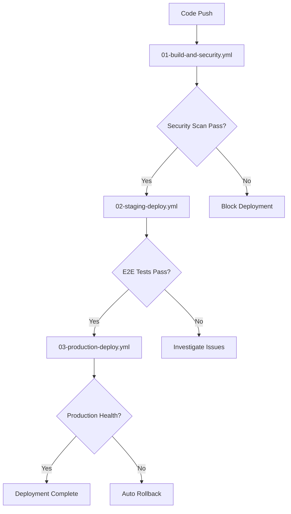

# ObsidianComments Deployment System

## Overview

This document describes the comprehensive CI/CD deployment system implemented for ObsidianComments, following enterprise best practices for security, reliability, and observability.

## Architecture

The deployment system uses a **three-stage pipeline** with proper gates, security scanning, and rollback capabilities:

1. **Build & Security** (Stage 1)
2. **Staging Deployment** (Stage 2) 
3. **Production Deployment** (Stage 3)

### Pipeline Flow



## Stage 1: Build & Security (.github/workflows/01-build-and-security.yml)

### Features
- **Build Process**: Parallel builds for all services (backend, frontend, hocuspocus)
- **Security Scanning**:
  - npm audit for dependency vulnerabilities
  - Trivy container image scanning
  - Secret scanning with TruffleHog
- **Integration Testing**: Full stack integration tests with ephemeral environment
- **Environment Validation**: CORS, database, and nginx configuration checks

### Jobs
1. **build**: Builds and pushes Docker images to GHCR
2. **security**: Runs security scans and uploads results to GitHub Security tab
3. **integration**: Deploys ephemeral stack and runs integration tests
4. **build-status**: Gates progression to next stage

### Key Security Features
- **SARIF Integration**: Security scan results uploaded to GitHub Security tab
- **Dependency Scanning**: Automated npm audit with configurable severity levels
- **Container Scanning**: Trivy scans for OS and library vulnerabilities
- **Secret Detection**: TruffleHog prevents credential leaks

## Stage 2: Staging Deployment (.github/workflows/02-staging-deploy.yml)

### Features
- **Pre-flight Validation**: Environment contracts, migrations, nginx config
- **Staging Deployment**: Full production-like environment
- **Comprehensive E2E Testing**: Multi-browser testing with Playwright
- **Performance Testing**: Load testing with k6

### Jobs
1. **preflight**: Validates deployment prerequisites
2. **deploy-staging**: Deploys to staging environment
3. **e2e-staging**: Runs full E2E test suite
4. **performance**: Load and performance testing
5. **staging-status**: Gates promotion to production

### Testing Strategy
- **E2E Tests**: Complete user workflows across browsers
- **Performance Tests**: Response time and throughput validation
- **Integration Tests**: Cross-service communication validation
- **Database Tests**: Migration and data integrity checks

## Stage 3: Production Deployment (.github/workflows/03-production-deploy.yml)

### Features
- **Blue/Green Deployment**: Zero-downtime deployment strategy
- **Database Migrations**: Safe schema updates with rollback capability
- **Post-Deploy Verification**: Comprehensive health checks
- **Automated Rollback**: Triggered on verification failures

### Jobs
1. **production-preflight**: Final pre-deployment validation
2. **blue-green-deploy**: Implements blue/green deployment pattern
3. **post-deploy-verification**: Validates deployment success
4. **rollback**: Automatic rollback on failure (manual trigger available)
5. **deployment-status**: Final deployment status tracking

### Deployment Strategy
- **Blue Environment**: Current production
- **Green Environment**: New deployment
- **Traffic Switch**: Instantaneous switchover after validation
- **Rollback Ready**: Blue environment kept for immediate rollback

## Supporting Infrastructure

### Docker Compose Configurations

#### Production (docker-compose.production.yml)
- **Services**: postgres, redis, backend, hocuspocus, frontend, nginx
- **Networks**: Isolated production network
- **Health Checks**: Comprehensive health monitoring
- **Security**: No exposed ports except nginx

#### E2E Testing (docker-compose.e2e.yml)
- **Ephemeral**: Designed for teardown after tests
- **Isolated Ports**: No conflicts with running services
- **Test Database**: Separate test data
- **Network**: Isolated e2e network

#### Nginx Configurations
- **nginx-fixed.conf**: Production configuration with optimized settings
- **nginx-e2e.conf**: E2E testing configuration
- **nginx-staging.conf**: Staging environment configuration

### Monitoring & Rollback Scripts

#### monitor-deployment.sh
**Features**:
- Continuous health monitoring (30s intervals)
- System resource monitoring (CPU, memory, disk)
- Container health checks
- HTTP endpoint monitoring
- Database connectivity checks
- WebSocket connectivity validation
- Automatic service restart on failures
- Alert system integration
- Metrics collection

**Configuration**:
```bash
MONITOR_INTERVAL=30      # Check interval in seconds
ALERT_THRESHOLD=3        # Failures before alert
RESTART_THRESHOLD=5      # Failures before restart
```

#### rollback-deployment.sh
**Features**:
- Zero-downtime rollback capability
- Database backup before rollback
- Health check validation
- Deployment verification
- Notification system
- Audit trail maintenance

**Usage**:
```bash
./scripts/rollback-deployment.sh --reason "Critical bug fix" --force
```

### Security Implementation

#### Vulnerability Scanning
- **Container Images**: Trivy scanner with SARIF output
- **Dependencies**: npm audit with severity filtering
- **Secrets**: TruffleHog secret detection
- **SAST Integration**: Results uploaded to GitHub Security tab

#### Environment Security
- **Secret Management**: GitHub Secrets for sensitive data
- **Network Isolation**: Docker networks for service isolation
- **Resource Limits**: Container resource constraints
- **Health Monitoring**: Continuous security posture monitoring

#### CORS Configuration
- **Obsidian Plugin Support**: `app://obsidian.md` origin allowed
- **API Security**: Proper CORS headers for cross-origin requests
- **WebSocket Security**: Secure WebSocket connections

### Performance & Reliability

#### Load Balancing
- **Nginx**: Reverse proxy with upstream configuration
- **Health Checks**: Automatic unhealthy backend removal
- **Connection Pooling**: Keep-alive connections
- **Static Asset Caching**: Optimized cache headers

#### Database Reliability
- **Health Checks**: pg_isready monitoring
- **Connection Pooling**: Redis connection management
- **Migration Safety**: Backward-compatible migrations
- **Backup Strategy**: Automated pre-rollback backups

#### Monitoring & Observability
- **Container Metrics**: CPU, memory, network usage
- **Application Metrics**: Response times, error rates
- **System Metrics**: Host resource utilization
- **Log Aggregation**: Centralized logging with retention

### Critical Testing Strategy

#### E2E Test Coverage (tests/e2e/critical-path.spec.js)
1. **Document Loading**: JavaScript error detection
2. **CSP Compliance**: Content Security Policy validation
3. **Yjs Integration**: Real-time collaboration testing
4. **Editor Functionality**: Text editing and persistence
5. **Collaboration**: Multi-user testing
6. **WebSocket Health**: HocusPocus connection validation
7. **Database Operations**: CRUD operation testing
8. **Rate Limiting**: Redis-based rate limiting
9. **Asset Loading**: Frontend resource validation
10. **Service Health**: Comprehensive health checks
11. **Data Persistence**: Cross-session data validation

#### Performance Testing
- **Load Testing**: k6-based performance validation
- **Response Time**: 95th percentile under 2 seconds
- **Throughput**: Concurrent user handling
- **Resource Usage**: Memory and CPU limits

## Deployment Workflows

### Development to Production Flow

1. **Feature Development**
   ```bash
   git checkout -b feature/new-feature
   # ... development work ...
   git push origin feature/new-feature
   # Create Pull Request
   ```

2. **Pull Request Validation**
   - Automated CI checks (01-build-and-security.yml)
   - Security scanning
   - Integration testing
   - Code review

3. **Merge to Main**
   ```bash
   git checkout main
   git merge feature/new-feature
   git push origin main
   ```

4. **Automatic Deployment Pipeline**
   - Stage 1: Build & Security (01-build-and-security.yml)
   - Stage 2: Staging Deploy (02-staging-deploy.yml)
   - Stage 3: Production Deploy (03-production-deploy.yml)

### Manual Rollback Process

1. **Immediate Rollback**
   ```bash
   ./scripts/rollback-deployment.sh --reason "Critical issue" --force
   ```

2. **Planned Rollback**
   ```bash
   ./scripts/rollback-deployment.sh --reason "Planned maintenance"
   # Confirm with: yes
   ```

### Monitoring Setup

1. **Start Continuous Monitoring**
   ```bash
   ./scripts/monitor-deployment.sh &
   ```

2. **Custom Monitoring Intervals**
   ```bash
   ./scripts/monitor-deployment.sh --interval 60 --alert-threshold 2
   ```

## Environment Configuration

### Required Secrets (GitHub Repository Secrets)
- `POSTGRES_PASSWORD`: Database password
- `JWT_SECRET`: JWT signing secret
- `GITHUB_TOKEN`: Automatically provided by GitHub
- `SSH_PRIVATE_KEY`: Server access key (if deploying to remote servers)
- `PRODUCTION_HOST`: Production server hostname

### Environment Variables
- `NODE_ENV`: Environment (development/staging/production)
- `DATABASE_URL`: PostgreSQL connection string
- `REDIS_URL`: Redis connection string
- `CORS_ORIGIN`: Allowed CORS origins
- `RATE_LIMIT_WINDOW`: Rate limiting window
- `RATE_LIMIT_MAX`: Rate limiting maximum requests

## Troubleshooting

### Common Issues

#### Deployment Failures
1. **Image Not Found**: Check GHCR registry access
2. **Health Check Timeout**: Verify service health endpoints
3. **Database Migration**: Check migration files and permissions
4. **Port Conflicts**: Ensure proper port configuration

#### Performance Issues
1. **High CPU**: Check container resource limits
2. **Memory Leaks**: Monitor container memory usage
3. **Database Slow**: Check connection pool settings
4. **WebSocket Issues**: Verify HocusPocus configuration

#### Security Alerts
1. **Vulnerability Scan Failures**: Update dependencies
2. **Secret Detection**: Remove exposed secrets
3. **CSP Violations**: Update Content Security Policy
4. **CORS Issues**: Verify origin configuration

### Diagnostic Commands

```bash
# Check service health
docker-compose -f docker-compose.production.yml ps
docker-compose -f docker-compose.production.yml logs

# Check container resources
docker stats

# Check database connectivity
docker exec postgres-container pg_isready -U postgres

# Check application endpoints
curl -f http://localhost/health
curl -f http://localhost/api/health

# Monitor real-time logs
tail -f /var/log/obsidian-monitor.log
```

## Best Practices

### Development
- **Test-Driven Development**: Write tests before implementation
- **Small Commits**: Frequent, descriptive commits
- **Feature Branches**: Isolated feature development
- **Code Review**: Mandatory peer review

### Security
- **Secret Rotation**: Regular secret updates
- **Dependency Updates**: Keep dependencies current
- **Vulnerability Scanning**: Continuous security monitoring
- **Access Control**: Principle of least privilege

### Operations
- **Monitoring**: Continuous health monitoring
- **Backup Strategy**: Regular database backups
- **Documentation**: Keep deployment docs current
- **Incident Response**: Defined response procedures

## Integration Points

### External Services
- **GitHub Container Registry**: Docker image storage
- **GitHub Security**: Vulnerability reporting
- **Monitoring Systems**: Health check integration
- **Notification Systems**: Alert delivery

### Obsidian Plugin Integration
- **CORS Configuration**: Proper origin handling
- **API Compatibility**: Stable API contracts
- **Authentication**: Secure token handling
- **Real-time Sync**: WebSocket reliability

## Conclusion

This deployment system provides enterprise-grade reliability, security, and observability for the ObsidianComments application. The three-stage pipeline ensures thorough validation before production deployment, while the monitoring and rollback capabilities provide operational confidence and rapid recovery from issues.

The system is designed to be maintainable, extensible, and aligned with modern DevOps best practices.